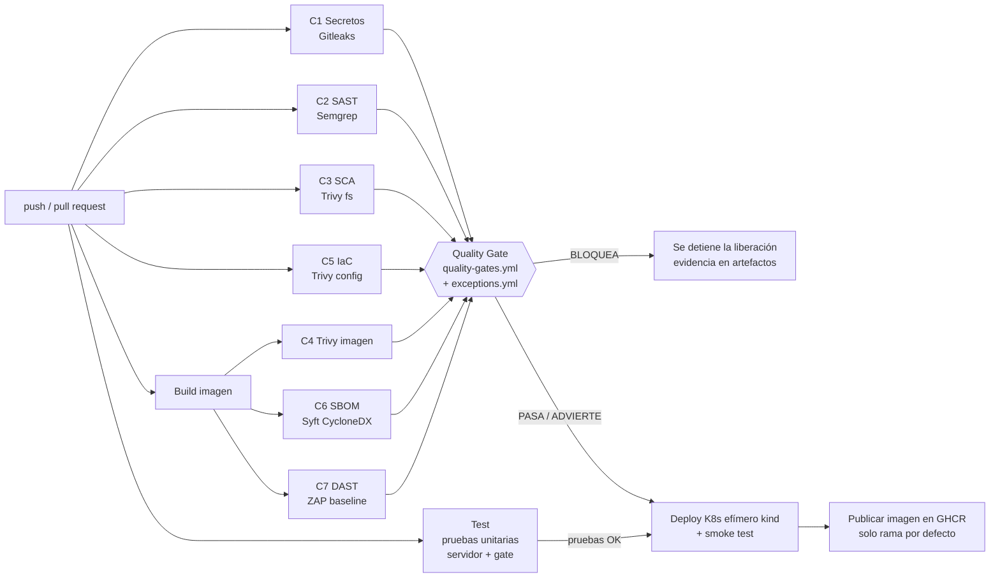

# Diagrama del pipeline

```mermaid
flowchart LR
  A[push / pull request] --> B1[C1 Secretos<br/>Gitleaks]
  A --> B2[C2 SAST<br/>Semgrep]
  A --> B3[C3 SCA<br/>Trivy fs]
  A --> B4[C5 IaC<br/>Trivy config]
  A --> B5[Build imagen]
  A --> T[Test<br/>pruebas unitarias<br/>servidor + gate]
  B5 --> C1[C4 Trivy imagen]
  B5 --> C2[C6 SBOM<br/>Syft CycloneDX]
  B5 --> D[C7 DAST<br/>ZAP baseline]
  B1 & B2 & B3 & B4 & C1 & C2 & D --> G{{Quality Gate<br/>quality-gates.yml<br/>+ exceptions.yml}}
  G -- BLOQUEA --> X[Se detiene la liberación<br/>evidencia en artefactos]
  G -- PASA / ADVIERTE --> K[Deploy K8s efímero kind<br/>+ smoke test]
  T -- pruebas OK --> K
  K --> P[Publicar imagen en GHCR<br/>solo rama por defecto]
```

Cada scanner entrega un reporte JSON; el único punto de decisión de seguridad es el Quality Gate. El despliegue exige además que las pruebas unitarias pasen.
